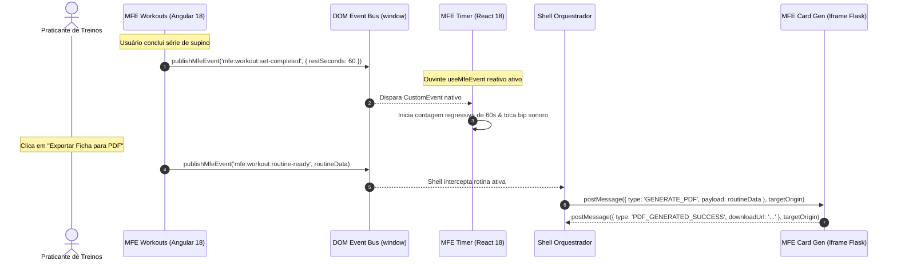

# 🌐 FitLab Shell — Enterprise Micro Frontend Architecture

> **Modelo de Referência Arquitetural para Sistemas Escaláveis de Alta Complexidade**  
> _Implementação prática de um ecossistema Multirepo com Native Federation (ESM / Import Maps W3C), orquestração poliglota (Angular 18, React 18, Vue 3, Python Flask), comunicação agnóstica a frameworks, esteiras de CI/CD independentes e distribuição global em nuvem (AWS CloudFront + Multi-Bucket S3)._

---

## 🧭 1. Visão Executiva & Contexto Arquitetural

### 1.1. O Desafio de Escala Organizacional

Em corporações com múltiplos times de produto e engenharia (Engenharia de Plataforma, Squads de Domínio, Especialistas em UI/UX e Manutenção de Legados), a abordagem monolítica tradicional gera gargalos severos de escala:

- **Fadiga de Release:** Conflitos constantes em branches principais e filas demoradas de testes integrados.
- **Bloqueio Tecnológico ("Version Locking"):** Dificuldade de atualizar versões de bibliotecas ou adotar ferramentas modernas sem forçar uma migração em massa de todo o sistema.
- **Falta de Isolamento de Falhas:** Erros ou memory leaks originados em uma funcionalidade secundária derrubam a experiência global do usuário.

### 1.2. O Modelo Multirepo como Padrão Corporativo

Este ecossistema foi projetado sob o modelo **Multirepo** (repositórios Git isolados), reproduzindo com fidelidade a governança adotada em grandes empresas de tecnologia:

- **Autonomia Total de Ciclo de Vida:** Cada repositório tem seus próprios mantenedores, branch protections, testes automatizados e pipelines de entrega contínua.
- **Deploy Independente com Zero-Deploy no Host:** Novos Micro Frontends e atualizações de módulos existentes são disponibilizados em produção sem necessidade de rebuild, redeploy ou reinicialização da Shell.
- **Governança Unificada por Pacotes:** Padrões de código (ESLint Flat Config, boundaries de arquitetura, contratos tipados e schematics de automação) são centralizados e distribuídos via pacote versionado (`@fitlab/tooling`).

### 1.3. O Tema "FitLab" como Vetor de Validação Prática

> [!NOTE]
> **A arquitetura aqui concebida é 100% agnóstica a domínio de negócio.**  
> O tema de saúde, treinos e nutrição (_FitLab_) foi selecionado deliberadamente como um **Vetor de Execução (Case Study de Validação)** para simular e comprovar cenários complexos reais em uma única solução:
>
> 1. **Módulo Principal com Máxima Performance:** Gestão de treinos complexos exigindo reatividade refinada (Angular 18 com Signals).
> 2. **UI de Alta Frequência de Renderização:** Cronômetro de alta precisão animando milissegundos e física de transição (React 18).
> 3. **Componente Visual Leve e Isolado:** Gráfico de macronutrientes compilado como Web Component leve (Vue 3).
> 4. **Integração de Sistema Legado/Servidor:** Geração e exportação de fichas em PDF processadas no backend (Python Flask).

---

## 🏛️ 2. Desenho Arquitetural de Ponta a Ponta

O diagrama a seguir ilustra o fluxo completo: desde a camada de entrega na borda (Edge / CDN) até a composição em tempo de execução no navegador e as bibliotecas de suporte transversal.

```mermaid
graph TB
    %% Estilos Globais
    classDef cloud fill:#0f172a,stroke:#38bdf8,stroke-width:2px,color:#f8fafc;
    classDef host fill:#1e1b4b,stroke:#818cf8,stroke-width:2px,color:#f8fafc;
    classDef remote fill:#064e3b,stroke:#34d399,stroke-width:2px,color:#f8fafc;
    classDef shared fill:#701a75,stroke:#f472b6,stroke-width:2px,color:#f8fafc;
    classDef browser fill:#18181b,stroke:#a1a1aa,stroke-width:2px,color:#f8fafc;

    subgraph CLOUD_LAYER ["☁️ Camada de Nuvem & Borda (AWS)"]
        CF["AWS CloudFront CDN<br/>(Domínio Único Global)"]:::cloud
        S3_SHELL["S3: fitlab-mfe-shell-dev<br/>(/*)"]:::cloud
        S3_WORKOUTS["S3: fitlab-mfe-workouts-dev<br/>(/workouts/*)"]:::cloud
        S3_TIMER["S3: fitlab-mfe-timer-dev<br/>(/timer/*)"]:::cloud
        S3_NUTRITION["S3: fitlab-mfe-nutrition-dev<br/>(/nutrition/*)"]:::cloud
        S3_CARDS["S3: fitlab-mfe-card-generator-dev<br/>(/card-generator/*)"]:::cloud

        CF -->|Behavior: /*| S3_SHELL
        CF -->|Behavior: /workouts/*| S3_WORKOUTS
        CF -->|Behavior: /timer/*| S3_TIMER
        CF -->|Behavior: /nutrition/*| S3_NUTRITION
        CF -->|Behavior: /card-generator/*| S3_CARDS
    end

    subgraph RUNTIME_BROWSER ["🖥️ Ambiente de Execução do Navegador (Client-Side)"]
        subgraph SHELL_HOST ["🌐 fitlab-shell (Host / Angular 18)"]
            BOOTSTRAP["Bootstrap & Import Maps (Native Federation)"]:::host
            NAV_GUARD["MfeStatusGuard & Data-Driven Router"]:::host
            CONTEXT_SVC["MfeContextService (Snapshot Provider)"]:::host
            WRAPPER["MfeWrapperComponent (Header, Skeleton & Lazy Loader)"]:::host
        end

        subgraph REMOTES_LAYER ["🧩 Micro Frontends Remotos (Poliglotas)"]
            REMOTE_A["🏋️ MFE Workouts<br/>(Angular 18)<br/><b>Estratégia: Native Federation</b>"]:::remote
            REMOTE_B["⏱️ MFE Timer<br/>(React 18)<br/><b>Estratégia: Web Component</b>"]:::remote
            REMOTE_C["🥗 MFE Nutrition<br/>(Vue 3)<br/><b>Estratégia: Custom Element</b>"]:::remote
            REMOTE_D["📄 MFE Card Generator<br/>(Python Flask)<br/><b>Estratégia: Iframe Controlado</b>"]:::remote
        end

        subgraph STATE_COMMUNICATION ["📡 Camada de Comunicação & Estado Global"]
            WIN_CTX["window.mfeContext<br/>(Snapshot Síncrono Zero-Dependency)"]:::browser
            DOM_BUS["DOM CustomEvent Bus<br/>(Barramento de Eventos Desacoplado)"]:::browser
            POST_MSG["PostMessage Bridge<br/>(Ponte Segura com Verificação de Origem)"]:::browser
        end
    end

    subgraph SHARED_LIBS ["📦 Bibliotecas de Governança Compartilhadas"]
        LIB_TOOLING["@fitlab/tooling<br/>(Linting, Schematics, EventBus, Adapters)"]:::shared
        LIB_DS["@fitlab/design-system<br/>(CSS Tokens, Variáveis Globais, Componentes Puros)"]:::shared
    end

    %% Relações de Carregamento
    CF -.->|Carrega Assets| BOOTSTRAP
    BOOTSTRAP --> NAV_GUARD
    NAV_GUARD --> WRAPPER

    WRAPPER -->|loadRemoteModule()| REMOTE_A
    WRAPPER -->|customElements.define()| REMOTE_B
    WRAPPER -->|defineCustomElement()| REMOTE_C
    WRAPPER -->|sandbox iframe src| REMOTE_D

    %% Relações de Estado & Comunicação
    CONTEXT_SVC -->|Inicializa & Atualiza| WIN_CTX
    WIN_CTX -.->|Leitura Direta| REMOTE_A
    WIN_CTX -.->|Leitura Direta| REMOTE_B
    WIN_CTX -.->|Leitura Direta| REMOTE_C

    REMOTE_A <-->|publish / listen| DOM_BUS
    REMOTE_B <-->|publish / listen| DOM_BUS
    REMOTE_C <-->|publish / listen| DOM_BUS
    REMOTE_D <-->|postMessage seguro| POST_MSG
    POST_MSG <--> DOM_BUS

    %% Governança
    LIB_TOOLING -.->|Governa| SHELL_HOST
    LIB_TOOLING -.->|Governa| REMOTES_LAYER
    LIB_DS -.->|Estiliza| SHELL_HOST
    LIB_DS -.->|Estiliza| REMOTES_LAYER
```

---

## ⚖️ 3. As Quatro Camadas de Decisão Arquitetural

### 3.1. Native Federation vs. Webpack Module Federation

- **Decisão:** Adoção do **Native Federation** (`@angular-architects/native-federation`) baseado em **ES Modules nativos (ESM)** e **W3C Browser Import Maps**.
- **Motivação:** A partir do Angular 17/18, o motor padrão oficial de compilação é o `esbuild` / Vite (`@angular-devkit/build-angular:application`). O Webpack Module Federation clássico impunha manter builds Webpack legados lentos e polyfills de NodeJS no navegador. Com Native Federation:
  - O build é até **10x mais rápido**, reduzindo o ciclo de CI/CD.
  - O carregamento de dependências no browser é nativo, padronizado e livre de wrappers proprietários.

### 3.2. Resolução de Dependências em Tempo de Execução (Runtime Negotiation)

```javascript
// federation.config.js da Shell
const {
  withNativeFederation,
  shareAll
} = require('@angular-architects/native-federation/config');

module.exports = withNativeFederation({
  shared: {
    // 1. Singletons Estritos (Não podem ser duplicados na memória)
    '@angular/core': {
      singleton: true,
      strictVersion: true,
      requiredVersion: 'auto'
    },
    '@angular/common': {
      singleton: true,
      strictVersion: true,
      requiredVersion: 'auto'
    },
    '@angular/router': {
      singleton: true,
      strictVersion: true,
      requiredVersion: 'auto'
    },
    rxjs: { singleton: true, strictVersion: true, requiredVersion: 'auto' },

    // 2. Singletons Flexíveis (Deploy independente com compatibilidade SemVer)
    '@fitlab/design-system': {
      singleton: true,
      strictVersion: false,
      requiredVersion: '^1.0.0'
    },
    '@fitlab/tooling': {
      singleton: true,
      strictVersion: false,
      requiredVersion: '^1.0.0'
    },

    // 3. Demais dependências com negociação SemVer automática
    ...shareAll({ singleton: false, strictVersion: false })
  }
});
```

### 3.3. As Três Estratégias de Carregamento dos Remotos

```mermaid
flowchart TD
    START([Requisição de Rota pelo Usuário]) --> GUARD{MfeStatusGuard: MFE Ativo?}
    GUARD -- Não --> FALLBACK[Exibe Fallback / 404 sem baixar scripts]
    GUARD -- Sim --> WRAPPER[MfeWrapperComponent: Renderiza Header + Skeleton]

    WRAPPER --> TYPE{Qual o 'type' no Manifesto?}

    TYPE -- 'angular-native' --> STRAT_A[<b>1. Native Federation</b><br/>loadRemoteModule()<br/>Injeta rotas no Angular Router<br/>Compartilha Angular Core em memória]
    TYPE -- 'web-component' --> STRAT_B[<b>2. Custom Element</b><br/>Baixa bundle isolado<br/>customElements.define('mfe-tag')<br/>document.createElement('mfe-tag')<br/>Framework interno agnóstico (React/Vue)]
    TYPE -- 'iframe' --> STRAT_C[<b>3. Iframe Controlado</b><br/>Cria &lt;iframe sandbox&gt;<br/>Carrega URL legada / SSR<br/>Estabelece PostMessage Bridge seguro]

    STRAT_A --> MOUNT([Módulo Montado & Fade-In Ativo])
    STRAT_B --> MOUNT
    STRAT_C --> MOUNT
```

1. **Native Federation (`angular-native`):** Máxima performance para módulos no mesmo framework da Shell. Zero overhead de download do framework.
2. **Web Components (`web-component`):** Permite que times desenvolvam em **React** ou **Vue** mantendo encapsulamento visual e de ciclo de vida. A Shell apenas anexa o Custom Element no DOM.
3. **Iframe Controlado (`iframe`):** Garante a inclusão de monolitos legados ou sistemas que processam arquivos pesados (Python Flask/PDF), isolando totalmente os contextos de CSS e execução.

---

## 📡 4. Comunicação entre Sistemas, Estado & Payloads

A comunicação entre a Shell e os remotos opera sob o **Princípio de Zero Dependências Globais**. Não utilizamos bibliotecas de estado de terceiros (como Redux, NgRx ou Zustand) no objeto global da janela (`window`).



### 4.1. Snapshot Síncrono de Inicialização (`window.mfeContext`)

A Shell inicializa o contexto global durante o bootstrap, permitindo que qualquer MFE leia dados essenciais de forma síncrona:

```typescript
// @fitlab/tooling -> src/context/mfe-context.ts
export interface MfeUser {
  readonly id: string;
  readonly name: string;
  readonly email: string;
  readonly avatarUrl?: string;
}

export type MfeTheme = 'light' | 'dark';

export interface MfeContext {
  readonly token: string; // Token JWT de autenticação corporativa
  readonly permissions: readonly string[]; // Matriz de permissões (RBAC / Claims)
  readonly workspaceId: string; // Workspace ativo ('aluno' | 'professor' | 'tech')
  readonly user: Readonly<MfeUser>; // Dados do usuário ativo
  readonly theme: MfeTheme; // Tema selecionado
  readonly locale: string; // 'pt-BR' | 'en-US'
}
```

### 4.2. Contratos de Eventos Tipados (`@fitlab/tooling`)

```typescript
// @fitlab/tooling -> src/events/mfe-events.model.ts
export interface ShellEventPayloadMap {
  'mfe:shell:theme-changed': 'light' | 'dark';
  'mfe:shell:user-changed': MfeUser;
  'mfe:shell:workspace-changed': string;
  'mfe:shell:locale-changed': string;
  'mfe:shell:route-changed': {
    readonly path: string;
    readonly params: Readonly<Record<string, string>>;
    readonly queryParams: Readonly<Record<string, string>>;
  };
}

// Eventos de Domínio Inter-MFEs
export interface DomainEventPayloadMap {
  'mfe:workout:set-completed': {
    exerciseId: string;
    setIndex: number;
    restSeconds: number;
    timestamp: number;
  };
  'mfe:nutrition:goal-updated': {
    dailyCalories: number;
    proteinGrams: number;
  };
}
```

### 4.3. Consumo Idiomático por Framework

- **No Angular 18 (com Signals):**

  ```typescript
  import { useMfeSignal } from '@fitlab/tooling/angular';

  export class WorkoutComponent {
    readonly theme = useMfeSignal('mfe:shell:theme-changed', 'light');
  }
  ```

- **No React 18 (com Hooks):**

  ```tsx
  import { useMfeEvent } from '@fitlab/tooling/react';

  export const TimerWidget: React.FC = () => {
    const lastSet = useMfeEvent('mfe:workout:set-completed', null);
    // Reage automaticamente à nova série
  };
  ```

- **No Vue 3 (com Refs):**
  ```vue
  <script setup lang="ts">
  import { useMfeRef } from '@fitlab/tooling/vue';

  const user = useMfeRef('mfe:shell:user-changed', null);
  </script>
  ```

---

## 🔒 5. Segurança, Autenticação & Roteamento Orientado a Dados

### 5.1. Ciclo de Vida de Autenticação (Zero-Trust nos Remotos)

- **Shell como Provedora Central:** A Shell é o único ponto de integração com o Provedor de Identidade (IdP / OAuth2 / OIDC). Nenhum remote exibe telas de login ou manipula credenciais primárias.
- **Renovação Silenciosa:** Ao renovar o token JWT via refresh token, a Shell emite `mfe:shell:user-changed`, e todos os remotos atualizam seus cabeçalhos HTTP (`Authorization: Bearer <token>`) sem causar reload na página.
- **Diretiva Declarativa de Autorização (`*hasPermission`):**
  ```html
  <button *hasPermission="'workouts:export'" class="btn-primary">
    Exportar Treino
  </button>
  ```

### 5.2. Descoberta Dinâmica & Canary Deploys (`navigation.manifest.json`)

A Shell carrega a árvore de rotas dinamicamente a partir de um manifesto estático no CDN:

```json
{
  "workspaces": [
    {
      "id": "aluno",
      "label": "Espaço do Atleta",
      "items": [
        {
          "path": "workouts",
          "remoteName": "mfe-workout-planner",
          "entry": "/workouts/remoteEntry.json",
          "type": "angular-native",
          "label": "Treinos & Rotinas",
          "icon": "dumbbell",
          "status": "active"
        },
        {
          "path": "timer",
          "remoteName": "mfe-interval-timer",
          "entry": "/timer/remoteEntry.js",
          "type": "web-component",
          "elementTag": "fitlab-interval-timer",
          "label": "Cronômetro de Séries",
          "icon": "clock",
          "status": "canary",
          "canaryRole": "beta-tester"
        }
      ]
    }
  ]
}
```

- **Lógica do `MfeStatusGuard`:**
  1. Se `status: "inactive"`: A rota é bloqueada imediatamente (Kill-Switch em caso de incidente de produção). **Nenhum arquivo JS é baixado**.
  2. Se `status: "canary"`: A Shell verifica se o usuário autenticado possui a claim `beta-tester`. Se não possuir, oculta o menu e bloqueia a navegação.
  3. Se `status: "active"`: Carregamento liberado globalmente.

---

## ☁️ 6. Arquitetura de Nuvem & DevOps (AWS S3 + CloudFront)

Provisionada de forma declarativa via **Terraform** no repositório `fitlab-infra`:

```mermaid
graph LR
    subgraph Users ["Usuários Globais"]
        CLIENT["Navegador Web"]
    end

    subgraph AWS_EDGE ["AWS Edge Network"]
        CF["AWS CloudFront Distribution<br/>(Cache de Borda, SSL/TLS, Domínio Único)"]
    end

    subgraph AWS_STORAGE ["AWS S3 Private Buckets (OAC Protegido)"]
        S3_SHELL["🪣 fitlab-mfe-shell-dev<br/>(Raiz /* e Manifestos Centrais)"]
        S3_WORKOUTS["🪣 fitlab-mfe-workouts-dev<br/>(Sub-path: /workouts/*)"]
        S3_TIMER["🪣 fitlab-mfe-timer-dev<br/>(Sub-path: /timer/*)"]
        S3_NUTRITION["🪣 fitlab-mfe-nutrition-dev<br/>(Sub-path: /nutrition/*)"]
        S3_CARDS["🪣 fitlab-mfe-card-generator-dev<br/>(Sub-path: /card-generator/*)"]
    end

    CLIENT -->|HTTPS / Único Domínio| CF
    CF -->|Default (*)| S3_SHELL
    CF -->|/workouts/*| S3_WORKOUTS
    CF -->|/timer/*| S3_TIMER
    CF -->|/nutrition/*| S3_NUTRITION
    CF -->|/card-generator/*| S3_CARDS
```

### Benefícios da Topologia:

1. **Zero CORS:** Todos os ativos são servidos sob o mesmo domínio primário via roteamento de borda do CloudFront (_Path Behaviors_).
2. **Segurança Zero-Trust na Nuvem:** Os buckets S3 são estritamente privados (`block_public_acls = true`, `block_public_policy = true`), acessíveis unicamente pela identidade do CloudFront via **Origin Access Control (OAC)** com validação de `AWS:SourceArn`.
3. **Isolamento de Blast Radius:** Cada squad faz upload apenas para o seu respectivo bucket S3. Um deploy com falha no MFE de Nutrição é incapaz de corromper os arquivos da Shell ou do Planejador de Treinos.

---

## 🛠️ 7. Guia de Execução & Desenvolvimento Local

### 7.1. Pré-requisitos

- **Node.js:** Versão 20.x ou superior (LTS)
- **NPM:** Versão 10.x ou superior

### 7.2. Executando a Shell Localmente

```bash
# Navegue até a pasta da Shell
cd fitlab-shell

# Instale as dependências
npm install

# Inicie o servidor de desenvolvimento
npm start
```

A Shell estará acessível em `http://localhost:4200`.

### 7.3. Desenvolvimento Integrado com Remoto Local (Import Map Overrides)

Para desenvolver um remote (ex: `fitlab-mfe-workout-planner`) integrado com a Shell sem precisar subir todos os outros remotos:

1. Suba o remoto localmente: `npm start` no repositório do remoto (ex: porta `4201`).
2. No console do navegador na Shell (`http://localhost:4200`), ative o override:
   ```javascript
   localStorage.setItem(
     'override:mfe-workout-planner',
     'http://localhost:4201/remoteEntry.json'
   );
   ```
3. Recarregue a página (`F5`). A Shell agora consumirá seu código local em tempo real, mantendo todo o restante do ecossistema vindo do ambiente de desenvolvimento estável.

---

## 📊 8. Scripts de Qualidade & Governança

```bash
# Executa testes unitários com Karma em modo headless e gera relatório de cobertura
npm run test:ci

# Executa linting estrito com ESLint Flat Config e Boundaries
npm run lint

# Aplica correções automáticas de lint
npm run lint:fix

# Formata código com Prettier
npm run format

# Compila a aplicação para produção utilizando esbuild
npm run build
```

---

## 🗺️ 9. Repositórios do Ecossistema

| Repositório                      | Descrição                              | Papel Arquitetural                        |
| :------------------------------- | :------------------------------------- | :---------------------------------------- |
| **`fitlab-shell`**               | Orquestrador e portal de entrada       | Host / Orchestrator                       |
| **`fitlab-lib-tooling`**         | Pacote NPM `@fitlab/tooling`           | Governança, Schematics e Contratos        |
| **`fitlab-lib-design-system`**   | Pacote NPM `@fitlab/design-system`     | Design Tokens e Variáveis Globais CSS     |
| **`fitlab-mfe-workout-planner`** | Montador de treinos e rotinas          | Remote (Angular 18 / Native Federation)   |
| **`fitlab-mfe-interval-timer`**  | Cronômetro de descanso                 | Remote (React 18 / Web Component)         |
| **`fitlab-mfe-nutrition`**       | Roda de macronutrientes                | Remote (Vue 3 / Custom Element)           |
| **`fitlab-mfe-card-generator`**  | Exportador de fichas em PDF            | Remote (Python Flask / Iframe Controlado) |
| **`fitlab-infra`**               | Infraestrutura como Código (Terraform) | AWS S3, CloudFront e Manifestos           |

---

<p align="center">
  <b>FitLab — Engenharia de Frontend em Escala Empresarial</b><br/>
  Desenvolvido com foco em desacoplamento, performance e autonomia de squads.
</p>
