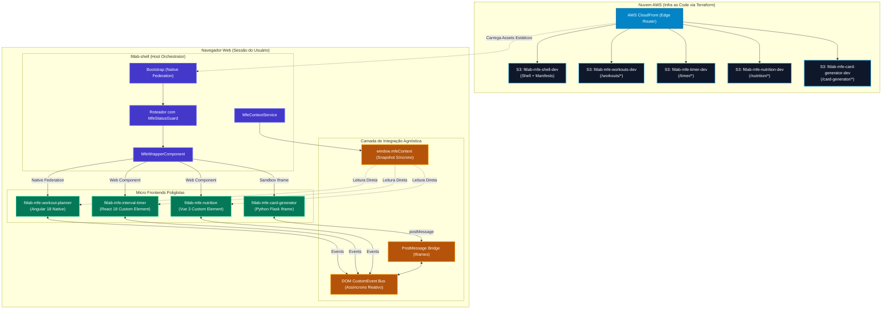
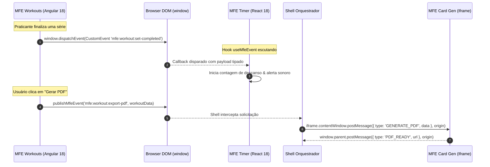
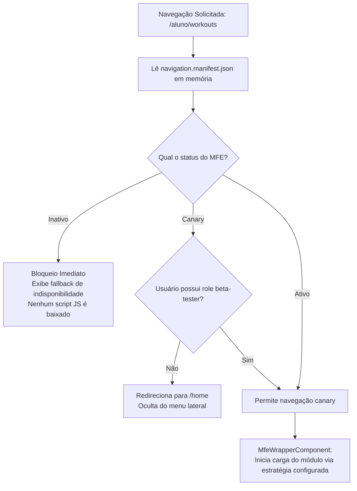
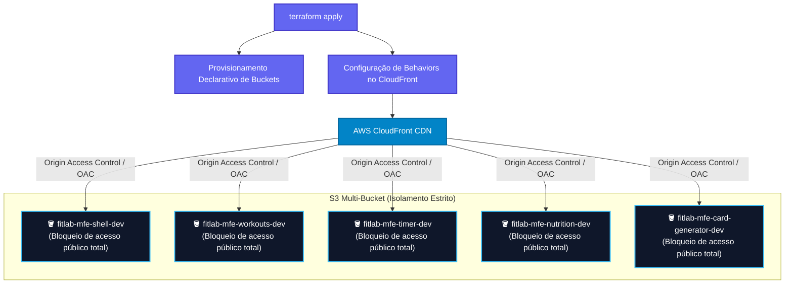

# 🏗️ Especificação de Arquitetura: Enterprise Micro Frontends Reference Model

> **Documento de Referência Técnica & Padrões Operacionais**  
> _Este documento registra as decisões de design, padrões técnicos, diagramas de sequência e diretrizes arquiteturais para o ecossistema de Micro Frontends (MFE)._

---

## 1. Posicionamento Arquitetural & Princípios

### 1.1. Propósito do Ecossistema

A presente arquitetura foi concebida para responder à pergunta central da engenharia de frontend corporativa:  
**Como permitir que dezenas de squads entreguem valor de forma contínua, em repositórios isolados e com autonomia de stack, garantindo consistência visual, performance e governança centralizada?**

### 1.2. O Domínio de Negócio como Vetor de Validação

O produto **FitLab** (saúde, treinos e nutrição) atua exclusivamente como um **Case Study Prático de Validação**. Ele foi escolhido deliberadamente porque reúne características ideais para testar os limites da arquitetura:

- Módulos de fluxo intenso (Treinos com Angular 18 e Signals).
- Componentes de renderização em alta frequência com física de animação (Cronômetro com React 18).
- Widgets visuais compactos isolados (Macronutrientes com Vue 3).
- Serviços utilitários legados executados no backend (Exportação PDF com Python Flask).

Essa mesma arquitetura de referência é 100% transferível para verticais como FinTech (Internet Banking + Checkout + PIX), E-commerce (Catálogo + Carrinho + Recomendações) ou Portais Corporativos B2B.

---

## 2. Topologia do Sistema & Fluxo de Dados Global



---

## 3. As 3 Estratégias de Integração de Remotos

### 3.1. Comparativo Técnico

| Parâmetro                        | 1. Native Federation (`angular-native`)      | 2. Web Components (`web-component`)                  | 3. Iframe Controlado (`iframe`)               |
| :------------------------------- | :------------------------------------------- | :--------------------------------------------------- | :-------------------------------------------- |
| **Frameworks Suportados**        | Mesmo framework da Shell (Angular 18)        | Qualquer framework moderno (React, Vue, Svelte)      | Qualquer tecnologia (SSR, Python, Java, PHP)  |
| **Mecanismo de Carregamento**    | `loadRemoteModule()` via Browser Import Maps | Script injection + `customElements.define()`         | Tag `<iframe sandbox>` com src dinâmico       |
| **Isolamento de CSS**            | Emulated View Encapsulation / Global CSS     | Shadow DOM ou Prefixo Scoped                         | 100% Isolado por Documento                    |
| **Performance de Inicialização** | Instantânea (reutiliza runtime do Angular)   | Rápida (download apenas do runtime do componente)    | Média (requisição de documento HTTP completo) |
| **Comunicação com a Shell**      | Memória direta + DOM CustomEvents            | Atributos HTML, Props e DOM CustomEvents             | `window.postMessage` com validação de origem  |
| **Projeto Validador**            | `fitlab-mfe-workout-planner`                 | `fitlab-mfe-interval-timer` & `fitlab-mfe-nutrition` | `fitlab-mfe-card-generator`                   |

### 3.2. Resolução de Dependências em Tempo de Execução (Native Federation)

Para remotos em Native Federation, as dependências são negociadas na memória do navegador:

```javascript
// federation.config.js (Shell & Remotes Angular)
const {
  withNativeFederation,
  shareAll
} = require('@angular-architects/native-federation/config');

module.exports = withNativeFederation({
  shared: {
    // Singletons Estritos (Não podem coexistir múltiplas versões)
    '@angular/core': {
      singleton: true,
      strictVersion: true,
      requiredVersion: 'auto'
    },
    '@angular/common': {
      singleton: true,
      strictVersion: true,
      requiredVersion: 'auto'
    },
    '@angular/router': {
      singleton: true,
      strictVersion: true,
      requiredVersion: 'auto'
    },
    rxjs: { singleton: true, strictVersion: true, requiredVersion: 'auto' },

    // Singletons Flexíveis (Deploy independente com range SemVer)
    '@fitlab/design-system': {
      singleton: true,
      strictVersion: false,
      requiredVersion: '^1.0.0'
    },
    '@fitlab/tooling': {
      singleton: true,
      strictVersion: false,
      requiredVersion: '^1.0.0'
    },

    // Fallback SemVer automático para pacotes de terceiros
    ...shareAll({ singleton: false, strictVersion: false })
  }
});
```

---

## 4. Barramento de Comunicação & Contratos de Payload

A comunicação não utiliza bibliotecas centralizadas de terceiros (sem NgRx global, Redux ou Pinia no window), garantindo 100% de agnosticismo a frameworks.



### 4.1. Snapshot Síncrono (`window.mfeContext`)

```typescript
export interface MfeUser {
  readonly id: string;
  readonly name: string;
  readonly email: string;
  readonly avatarUrl?: string;
}

export type MfeTheme = 'light' | 'dark';

export interface MfeContext {
  readonly token: string;
  readonly permissions: readonly string[];
  readonly workspaceId: string;
  readonly user: Readonly<MfeUser>;
  readonly theme: MfeTheme;
  readonly locale: string;
}
```

### 4.2. Contratos de Eventos Tipados (`@fitlab/tooling`)

```typescript
export const SHELL_EVENTS = {
  THEME_CHANGED: 'mfe:shell:theme-changed',
  USER_CHANGED: 'mfe:shell:user-changed',
  WORKSPACE_CHANGED: 'mfe:shell:workspace-changed',
  LOCALE_CHANGED: 'mfe:shell:locale-changed',
  ROUTE_CHANGED: 'mfe:shell:route-changed'
} as const;

export interface ShellEventPayloadMap {
  [SHELL_EVENTS.THEME_CHANGED]: MfeTheme;
  [SHELL_EVENTS.USER_CHANGED]: Readonly<MfeUser>;
  [SHELL_EVENTS.WORKSPACE_CHANGED]: string;
  [SHELL_EVENTS.LOCALE_CHANGED]: string;
  [SHELL_EVENTS.ROUTE_CHANGED]: {
    readonly path: string;
    readonly params: Readonly<Record<string, string>>;
    readonly queryParams: Readonly<Record<string, string>>;
  };
}
```

---

## 5. Roteamento Orientado a Dados, Canary & Governança de Acesso

### 5.1. Fluxo do Guard de Rota (`MfeStatusGuard`)



### 5.2. Manifesto Dinâmico de Navegação (`navigation.manifest.json`)

```json
{
  "workspaces": [
    {
      "id": "aluno",
      "label": "Espaço do Aluno",
      "items": [
        {
          "path": "workouts",
          "remoteName": "mfe-workout-planner",
          "entry": "/workouts/remoteEntry.json",
          "type": "angular-native",
          "label": "Treinos & Exercícios",
          "icon": "dumbbell",
          "status": "active"
        },
        {
          "path": "timer",
          "remoteName": "mfe-interval-timer",
          "entry": "/timer/remoteEntry.js",
          "type": "web-component",
          "elementTag": "fitlab-interval-timer",
          "label": "Cronômetro de Séries",
          "icon": "clock",
          "status": "canary",
          "canaryRole": "beta-tester"
        }
      ]
    }
  ]
}
```

---

## 6. Infraestrutura de Nuvem AWS (IaC com Terraform)



### Regras de OAC & Segurança em Nuvem:

1. **Buckets 100% Privados:** Todo tráfego direto para os endpoints do S3 é bloqueado via `block_public_acls = true` e `block_public_policy = true`.
2. **Autenticação de Borda:** Apenas chamadas assinadas originadas pelo CloudFront são aceitas através de uma declaração de IAM Policy com a condição:
   ```hcl
   condition {
     test     = "StringEquals"
     variable = "AWS:SourceArn"
     values   = [aws_cloudfront_distribution.mfe_cdn.arn]
   }
   ```
3. **Isolamento de Falha no Deploy:** A esteira de CI de cada MFE possui credenciais restritas via IAM para sincronizar apenas o seu bucket (`s3://fitlab-mfe-[nome]-[env]/`), impossibilitando acidentes de sobrescrita cruzada de arquivos.
