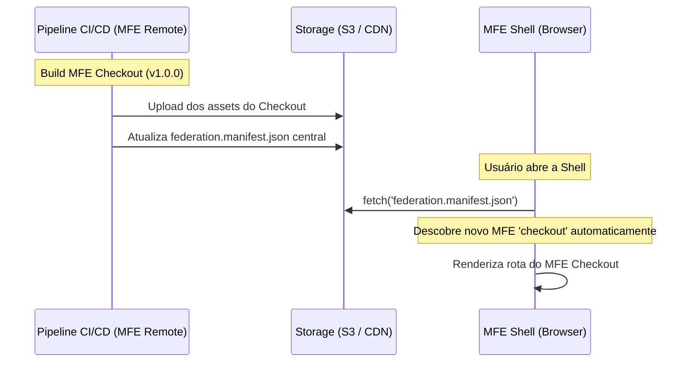

# 🔍 Pesquisa e Descobertas: Integração, Sobrescrita Local e Descoberta de MFEs

Este documento registra as pesquisas iniciais e conceitos propostos para solucionar os desafios de integração, desenvolvimento local independente e descoberta dinâmica de novos micro-frontends (zero-deploy) no ecossistema.

---

## 1. Sobrescrita de Import Maps em Runtime (Import Map Overrides)

### 🔴 O Problema

Em um ecossistema com muitos Micro Frontends, é inviável exigir que um desenvolvedor execute todos os repositórios (Shell + Remoto A + Remoto B + Remoto C) localmente apenas para testar a integração da funcionalidade que ele está desenvolvendo no Remoto A. Isso consome memória RAM excessiva e reduz drasticamente a velocidade de entrega.

### 🟢 A Solução

Como utilizamos **Native Federation** (baseado em Import Maps nativos do navegador), podemos realizar **sobrescritas dinâmicas diretamente no cliente** (navegador do desenvolvedor), sem necessidade de rodar proxies locais no sistema operacional (como Nginx local ou alterações no `/etc/hosts`).

#### Fluxo de Execução do Desenvolvedor:

1.  O desenvolvedor abre a **Shell** apontando para o ambiente de desenvolvimento comum da empresa (ex: `https://dev.mfe-cookbook.com`).
2.  Por padrão, a Shell carrega todos os micro-frontends remotos a partir do CDN de desenvolvimento.
3.  O desenvolvedor deseja alterar apenas o MFE de produtos. Ele clona o repositório `mfe-products` e roda localmente:
    ```bash
    npm run start # Executa na porta 4201
    ```
4.  O desenvolvedor abre um painel de controle (Developer Tooling) embutido temporariamente na Shell (ativado via query string ou console) e marca:
    - `[x] Redirecionar 'products' para http://localhost:4201/remoteEntry.json`
5.  A Shell salva essa preferência no `localStorage` do navegador do desenvolvedor:
    ```javascript
    localStorage.setItem(
      'override:products',
      'http://localhost:4201/remoteEntry.json'
    );
    ```
6.  Ao atualizar a página, o carregador do Native Federation na Shell lê essa chave e, ao gerar o Import Map dinâmico, substitui o endereço de produção/dev do remote de produtos pelo endereço do `localhost`.
7.  **Resultado:** O desenvolvedor testa suas mudanças locais integrado em tempo real com toda a infraestrutura e dados do ambiente de desenvolvimento estável, sem consumir recursos locais desnecessários.

---

## 2. Descoberta Dinâmica de MFEs (Zero-Deploy na Shell)

### 🔴 O Problema

Sempre que um novo Micro Frontend Remote é criado, o time da Shell não deveria ter que alterar o código do roteamento ou do manifesto da Shell, testar, homologar e fazer um deploy de produção da Shell apenas para "avisar" que um novo MFE existe. Isso gera gargalos de entrega e acoplamento entre os times.

### 🟢 A Solução

Implementar um **registro de descoberta dinâmico** por meio de um manifesto externo.



#### Mecanismo Técnico:

1.  **Bootstrap Externo:** Na inicialização da Shell, o código executa um `fetch()` para buscar um arquivo JSON central hospedado em um storage estático de alta disponibilidade (ex: AWS S3 + CloudFront):
    ```javascript
    // app.config.ts (Shell)
    import { initFederation } from '@angular-architects/native-federation';

    export const appConfig: ApplicationConfig = {
      providers: [
        provideAppInitializer(() => {
          return fetch('https://meu-cdn.com/federation.manifest.json')
            .then(res => res.json())
            .then(manifest => initFederation(manifest));
        })
      ]
    };
    ```
2.  **Atualização no Deploy:** Quando o pipeline de CI/CD de um remote é concluído, ele envia os novos arquivos de build para o S3 e, como última etapa da esteira, executa um script CLI leve que lê o `federation.manifest.json` do CDN, adiciona (ou atualiza) a entrada daquele MFE, e envia o JSON de volta.
3.  **Transparência:** A Shell descobre a existência e a nova URL do Remote instantaneamente no próximo F5 de qualquer usuário do sistema, sem necessidade de deploy da casca.

---

## 3. Proxy Reverso (Rede / CORS)

Durante as sessões de refinamento futuro, devemos avaliar se haverá necessidade de um **Proxy Reverso** (ex: Nginx ou http-proxy-middleware) rodando em produção ou desenvolvimento local.

- **Finalidade do Proxy:** Evitar problemas de **CORS** (Cross-Origin Resource Sharing) no navegador se os remotes e a Shell estiverem hospedados em domínios completamente diferentes (ex: `shell.com` buscando assets de `produtos-cdn.com`).
- **Decisão Inicial:** Preferir a liberação correta das diretivas de CORS e Headers de Cache no CDN (CloudFront/S3) para manter o carregamento direto do navegador, deixando o Proxy Reverso apenas como uma alternativa técnica de infraestrutura caso surjam restrições estritas de rede na empresa.
