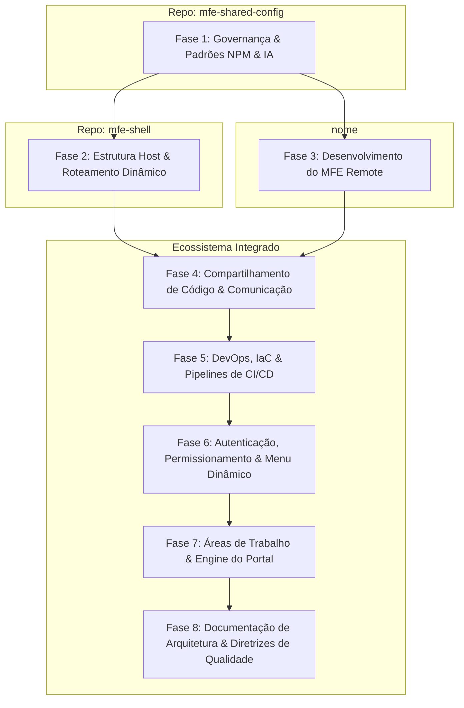

# 🚀 MFE Multirepo - Roadmap de Estudos & Evolução

Este documento serve como guia prático e roadmap de arquitetura para a construção de um ecossistema de **Micro Frontends (MFE)** baseado em repositórios separados (Multirepo), utilizando **Native Federation** e mantendo a qualidade técnica definida no `ng-cookbook`.

Para ver o tema de negócio oficial do projeto e como cada tecnologia é integrada, acesse o documento [project-theme.md](file:///Users/alexandre/Desktop/playground/mfe-cookbook/docs/project-theme.md).

O projeto visa simular o padrão corporativo de mercado utilizando três divisões principais de repositórios.

---

## 🗺️ Arquitetura de Repositórios & Fluxo de Dependências

---

## 📅 Detalhamento das Fases

### 🟢 Fase 1: Governança, Automação & Scaffolding (A criação do `@cookbook/mfe-tooling`)

Esta fase foca em construir o pacote de governança, regras de desenvolvimento baseadas em IA e geradores automáticos de projetos.

- **[Issue 1.1] Setup Inicial do Pacote `@cookbook/mfe-tooling`:** Criação do repositório dedicado para o pacote NPM de ferramentas.
- **[Issue 1.2] Configuração de Linting para Remotos (`@cookbook/eslint-config`):** Centralização das regras de qualidade (ESLint Flat Config + Prettier) otimizadas para Micro Frontends Remotos. A Shell terá suas regras de boundaries escritas localmente por ser uma aplicação única.
- **[Issue 1.3] Git Hooks & Husky Template:** Criação de scripts no pacote para instalar e padronizar o Husky e Commitlint em novos repositórios.
- **[Issue 1.4] Regras de IA e Custom Skills do Agentic SDLC (Mapeamento de IA):** Definição e empacotamento dos assets de IA (`.cursorrules` focados em boundaries e `window.mfeContext`) e custom skills (`create-issue`, `implement-issue` e `submit-issue` adaptados para repositórios separados).
- **[Issue 1.5] Schematic Angular de Geração Completa:** Desenvolvimento do schematic que gera o MFE Remote do zero e instala automaticamente o linting centralizado, git hooks locais, regras de IA, a esteira local de agentes e a estrutura de pastas feature-based.
- **[Issue 1.6] Documentação Universal & Automação Completa via `init-all`:** Inclusão de templates de arquitetura (`docs/architecture.md`), testing guidelines, agentic SDLC e execução encadeada de governança (`init-all`).
- **[Issue 1.7] Strict Linting, Karma Coverage Gates e Suite `TestHelper`:** Refinamento do ESLint para tipagem estrita (zero `any`), correção de sintaxe de boundaries, gates de cobertura de código (Statements, Branches, Functions, Lines) no Karma Headless e empacotamento da suite `TestHelper` (`queries`, `trigger`, `dispatch`) no `@fitlab/tooling/testing`.

---

### 🚀 Fase 2: Configuração da Shell (Host App)

A Shell funciona como o orquestrador principal e casca do ecossistema. Por ser um repositório único, suas configurações são diretas e locais.

- **[Issue 2.1] Scaffold Inicial do Repositório `mfe-shell`:** Inicialização da aplicação Angular utilizando o compilador padrão `esbuild` e setup local de Git, Husky, Commitlint e Prettier.
- **[Issue 2.2] Configuração de Linting e Boundaries Locais:** Escrita manual do `eslint.config.mjs` da Shell com regras estritas de boundaries focadas na casca (separando `core/layout`, `core/auth`, `core/theme` e impedindo imports cruzados).
- **[Issue 2.3] Setup do Native Federation na Shell (Host):** Integração do `@angular-architects/native-federation` como Host e mapeamento das dependências compartilhadas no `federation.config.js`.
- **[Issue 2.4] Manifesto Dinâmico & Roteamento:** Configuração da carga do `federation.manifest.json` na inicialização e roteamento dinâmico para carregamento dos remotes em tempo de execução via `loadRemoteModule`.
- **[Issue 2.5] Core Layout & Estado Reativo da Casca:** Desenvolvimento do layout estrutural (Header/Sidebar) e serviços reativos globais baseados em Signals (`AuthService` para compartilhar tokens e `ThemeService` para chaveamento de cores via CSS Variables).

---

### 📦 Fase 3: Configuração de um MFE Remote (Tema em Aberto)

O primeiro domínio de negócio operando 100% isolado, servindo de exemplo prático de implementação.

- **[Issue 3.1] Scaffold & Bootstrapping do Remote (`mfe-[nome]`):** Criação do repositório Git separado e execução do schematic `@cookbook/mfe-tooling:remote` para estruturar a aplicação na porta `4201`, herdando toda a governança e padrões de qualidade.
- **[Issue 3.2] Configuração do Native Federation & Exposição do Módulo:** Ajuste do `federation.config.js` do Remote declarando a exposição das rotas do negócio (ex: `./remote-routes`) e o compartilhamento flexível de dependências.
- **[Issue 3.3] Execução Autônoma Local:** Configuração do Remote para rodar de forma independente na porta `4201` via `ng serve`, permitindo o desenvolvimento isolado de layouts e lógica de tela.
- **[Issue 3.4] Arquitetura de Negócio Local (Feature do MFE):** Desenvolvimento do fluxo de negócio seguindo o padrão modular do `ng-cookbook` (domain, data-access com DTOs Zod/Mappers, application com Signal Store/Facade e páginas).

---

### 🔴 Fase 4: Compartilhamento de Código & Comunicação entre MFEs

Definição de limites estritos de comunicação e compartilhamento de contratos entre os projetos.

- **[Issue 4.1] Setup & Publicação do Design System (`@cookbook/design-system`):** Criação de repositório isolado contendo componentes puros e variáveis CSS globais, publicado como pacote NPM para consumo na Shell e nos Remotos.
- **[Issue 4.2] Comunicação Agnóstica via Eventos Nativos e Cache (State Coordinator):** Implementação na Shell de controle de estado em memória com despacho de `CustomEvent` nativos, mantendo suporte de RxJS como opção alternativa documentada para análises futuras.
- **[Issue 4.3] Comunicação via Roteamento e Estado de URL:** Padronização da passagem de dados por URL utilizando delegação de rotas (Wildcard Routing) e leitura reativa de parâmetros nos sub-roteadores dos Remotos.
- **[Issue 4.4] Centralização de Contratos de API Universais (Zod DTOs):** Criação do sub-pacote `@cookbook/contracts` contendo esquemas Zod estritamente transversais (como `UserProfileDTO` e `UserPermissionsDTO`), impedindo o acoplamento de DTOs de domínio de negócio específicos.

---

### ⚙️ Fase 5: DevOps, IaC (Terraform) e Pipelines de CI/CD

Entrega contínua e infraestrutura otimizada em um único ambiente.

- **[Issue 5.1] Terraform do Bucket de CDNs e CloudFront:** Criação declarativa da distribuição CloudFront e do Bucket S3 único compartilhado para armazenamento de todos os ativos do ecossistema sob um único ambiente unificado.
- **[Issue 5.2] Pipelines de CI/CD Estritas:** Criação de template de GitHub Actions para deploy dos remotes em subpastas do S3 sob o ambiente único, com trava lógica que usa o nome do repositório Git para garantir a unicidade de pasta.
- **[Issue 5.3] Atualização Dinâmica do Manifesto no Deploy:** Script na esteira de deploy dos remotes que registra ou atualiza seus metadados na pasta `/metadata/` do S3 para consolidação atômica de rotas.

---

### 🔑 Fase 6: Autenticação, Permissionamento & Orquestração de Menu Dinâmico

Segurança corporativa e orquestração do ecossistema guiada por dados.

- **[Issue 6.1] Autenticação e Propagação de Perfil:** Implementação na Shell do fluxo de login e exposição do perfil do usuário (`UserProfileDTO`) de forma reativa/síncrona via `window.mfeContext`.
- **[Issue 6.2] Diretivas de Acesso Reativas no Tooling:** Desenvolvimento de diretiva e utilitários de validação de permissões (ex: `*hasPermission`) empacotados no `@cookbook/mfe-tooling` para uso comum em todos os MFEs (inclusive na Shell).
- **[Issue 6.3] Bootstrap do Manifesto de Navegação na Shell:** Configurar a inicialização da Shell para buscar dinamicamente o arquivo `navigation.manifest.json` antes de renderizar a casca.
- **[Issue 6.4] Renderização Dinâmica e Filtro de Permissões na Sidebar:** Renderização condicional dos links na barra lateral comparando permissões exigidas no manifesto e permissões do usuário logado.
- **[Issue 6.5] Bloqueio e Guarda de Rotas para Status `inactive`:** Criação de Guard de Rota global (`MfeStatusGuard`) para impedir acessos diretos via URL a MFEs inativos, prevenindo downloads desnecessários de bundles.
- **[Issue 6.6] Lógica de Liberação Progressiva (Canary Deploy):** Mapeamento do status `canary` que permite a visualização e carregamento de MFEs experimentais apenas por usuários classificados no perfil como beta-testers.
- **[Issue 6.7] RFC/ADR do MFE Administrativo:** Elaboração do documento de especificação técnica para o futuro Remote administrativo que gerenciará o manifesto de rotas e permissões de forma visual.

---

### 🚀 Fase 7: Áreas de Trabalho & Engine do Portal de MFEs

Orquestração de áreas de trabalho personalizadas e funcionalidades comuns centralizadas.

- **[Issue 7.1] Mapeamento de Workspaces no Manifesto:** Redesenhar o esquema do `navigation.manifest.json` para suportar o agrupamento de `workspaces`, contendo suas próprias permissões e a lista de módulos (MFEs) associados a cada uma.
- **[Issue 7.2] Alternador de Áreas de Trabalho & Roteamento por Path Parameter:** Configurar o roteador da Shell para gerenciar o workspace ativo via parâmetro de caminho de rota (ex: `/:workspace-id`) com reload de contexto no chaveamento e switcher visual. _Nota: Decisão de usar ID ou Slug na URL está em aberto._
- **[Issue 7.3] Resolução de Área de Trabalho Padrão (Default Workspace & Fallback):** Criar um Guard de redirecionamento (`DefaultWorkspaceRedirectGuard`) na Shell para lidar com acessos à rota raiz `/`, caindo no workspace preferido ou no fallback.
- **[Issue 7.4] Layout do MFE Wrapper & Carga Estática via Manifesto:** Implementação do `MfeWrapperComponent` exibindo instantaneamente o título da aplicação (`label`) e renderizando suas ações básicas a partir do JSON do manifesto, aplicando um skeleton loader no conteúdo enquanto o JS carrega em background.
- **[Issue 7.5] Barramento de Cliques do Header (Shell -> Remote):** Configuração de botões de ação no Header para disparar `CustomEvent` nativos que o remoto escuta localmente para reagir a cliques de forma isolada.
- **[Issue 7.6] Sistema de Favoritos de MFEs por Área de Trabalho:** Adicionar ícone de favoritar no Header e criar a lógica de persistência e renderização rápida na sidebar da Shell.
- **[Issue 7.7] Modais de Metadados e Avaliação de MFE (Feedback Loop):** Criação das modais de visualização de informações do MFE (Nome, Squad, Versão) e de avaliação de experiência de uso.
- **[Issue 7.8] Especificação de Gestão de Workspaces na RFC Admin:** Atualizar a especificação do MFE Administrativo para contemplar a interface visual de criação de workspaces, vinculando MFEs e associando permissões.

---

### 🧪 Fase 8: Documentação de Arquitetura & Diretrizes de Qualidade

Capacitação técnica de equipes para criação, integração e qualidade consistente dentro do ecossistema de MFEs.

- **[Issue 8.1] Ajuste de Thresholds e Mocks no Schematic:** Configuração padrão de cobertura do Vitest em 85%-90% em novos remotes e templates para mocking de APIs com MSW.
- **[Issue 8.2] Playbook do Desenvolvedor - Scaffolding & Integração:** Escrita do guia de onboarding de criação de remotes e registro no manifesto central.
- **[Issue 8.3] Playbook de Comunicação & Roteamento:** Manual de integração por eventos nativos, cache e delegação de rotas por URL.
- **[Issue 8.4] Playbook de Qualidade & Testes:** Visão técnica das bibliotecas comuns (@cookbook/mfe-tooling e @cookbook/design-system) e recomendações de testes locais.
