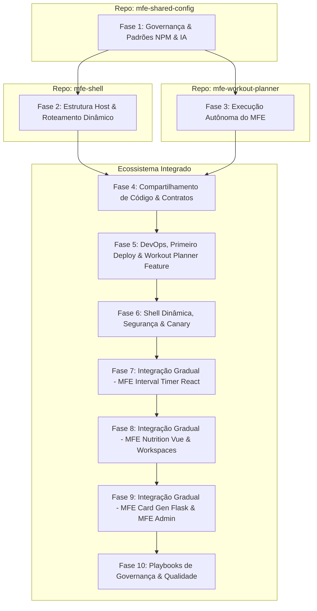

# 🚀 MFE Multirepo - Roadmap de Estudos & Evolução

Este documento serve como guia prático e roadmap de arquitetura para a construção de um ecossistema de **Micro Frontends (MFE)** baseado em repositórios separados (Multirepo), utilizando **Native Federation** e mantendo a qualidade técnica definida no `ng-cookbook`.

Para ver o tema de negócio oficial do projeto e como cada tecnologia é integrada, acesse o documento [project-theme.md](file:///Users/alexandre/Desktop/playground/fitlab/fitlab-shell/docs/project-theme.md).

O projeto visa simular o padrão corporativo de mercado utilizando divisões principais de repositórios integrados de forma gradual.

---

## 🗺️ Arquitetura de Repositórios & Fluxo de Dependências

---

## 📅 Detalhamento das Fases

### 🟢 Fase 1: Governança, Automação & Scaffolding
*Status: **CONCLUÍDO***

- [x] **[Issue 1.1] Setup Inicial do Pacote `@fitlab/tooling`:** Criação do repositório dedicado para o pacote NPM de ferramentas.
- [x] **[Issue 1.2] Configuração de Linting para Remotos:** Centralização das regras de qualidade (ESLint Flat Config + Prettier) no pacote de tooling.
- [x] **[Issue 1.3] Git Hooks & Husky Template:** Instalar e padronizar o Husky e Commitlint locais.
- [x] **[Issue 1.4] Regras de IA e Custom Skills:** Definição e empacotamento das custom skills (`create-issue`, `implement-issue` e `submit-issue`) adaptados para repositórios separados.
- [x] **[Issue 1.5] Schematic Angular de Geração Completa:** Desenvolvimento do schematic que gera o MFE Remote do zero e instala automaticamente as dependências comuns de governança.
- [x] **[Issue 1.6] Documentação Universal & Automação Completa via `init-all`:** Inclusão de templates de arquitetura e execução encadeada de governança.
- [x] **[Issue 1.7] Strict Linting, Karma Coverage Gates e Suite `TestHelper`:** Refinamento do ESLint para tipagem estrita, gates de cobertura de código no Karma Headless e empacotamento da suite de testes comuns.

---

### 🚀 Fase 2: Configuração da Shell (Host App)
*Status: **CONCLUÍDO***

- [x] **[Issue 2.1] Scaffold Inicial do Repositório `fitlab-shell`:** Inicialização da aplicação Angular utilizando o compilador padrão `esbuild`.
- [x] **[Issue 2.2] Configuração de Linting e Boundaries Locais:** Escrita manual do `eslint.config.mjs` da Shell com regras estritas de boundaries.
- [x] **[Issue 2.3] Setup do Native Federation na Shell (Host):** Integração do `@angular-architects/native-federation` como Host.
- [x] **[Issue 2.4] Manifesto Dinâmico & Roteamento:** Configuração da carga do `federation.manifest.json` na inicialização e roteamento dinâmico.
- [x] **[Issue 2.5] Core Layout & Estado Reativo da Casca:** Desenvolvimento do layout estrutural (Header/Sidebar) com suporte a Dark Mode e serviços de domínio com Signals.
- [x] **[Issue 2.6] Orquestrador de Contexto & Event Bus em Camadas:** Criação do `MfeContextService` na Shell, Event Bus universal no tooling e sugar adapter `useMfeSignal`.

---

### 📦 Fase 3: Configuração do MFE Remote (Workout Planner)
*Status: **CONCLUÍDO***

- [x] **[Issue 3.1] Scaffold & Bootstrapping do Remote:** Execução do schematic `@fitlab/tooling:mfe-remote` para estruturar a aplicação na porta `4201`.
- [x] **[Issue 3.2] Configuração do Native Federation & Exposição do Módulo:** Ajuste do `federation.config.js` do Remote declarando a exposição das rotas do negócio (`./routes`).
- [x] **[Issue 3.3] Execução Autônoma Local:** Configuração do Remote para rodar de forma independente e integrada via dev-server local sem conflito de portas ou erros de injeção contextuais.

---

### 🔴 Fase 4: Compartilhamento de Código & Contratos (Foco nas Libs)
Definição de limites estritos de comunicação e compartilhamento de contratos entre os projetos antes de mover para produção:

- [x] **[Issue 4.1] Setup & Publicação do Design System (`@fitlab/design-system`):** Criação de repositório isolado contendo componentes puros e variáveis CSS globais de tema (tokens) compartilhadas.
- [x] **[Issue 4.2] Comunicação Reativa Universal (`@fitlab/tooling`):** Extensão do tooling com os hooks idiomáticos de React (`useMfeEvent`) e Vue (`useMfeRef`) prontos para o consumo futuro dos próximos MFEs.
- [x] **[Issue 4.3] Comunicação via Roteamento e URL:** Padronização da passagem de dados por URL utilizando delegação de rotas (*Wildcard Routing*) e leitura reativa de parâmetros nos sub-roteadores dos Remotos.

---

### ⚙️ Fase 5: Infraestrutura de CDN, Primeiro Deploy & Workout Planner Feature
Estabelecer a infraestrutura em nuvem, criar a esteira de CD e completar o fluxo de negócio do primeiro MFE:

- [x] **[Issue 5.1] Terraform do Bucket de CDNs e CloudFront:** Criação declarativa da distribuição CloudFront e do Bucket S3 único compartilhado para armazenamento de todos os ativos do ecossistema.
- [x] **[Issue 5.2] Pipelines de CI/CD da Shell e Workout Planner (Casca):** Template de GitHub Actions para deploy automático da Shell, do Design System, do Tooling e da casca de aviso do Workout Planner no S3.
- [x] **[Issue 5.3] Geração Declarativa do Manifesto via Terraform no S3:** Geração automatizada do `federation.manifest.json` na raiz da CDN baseando-se na lista central de MFEs de infraestrutura, protegendo-o durante os deploys.
- [x] **[Issue 5.4] Arquitetura de Negócio Local (Finalização do Workout Planner):** Desenvolvimento do fluxo de negócio de montagem de exercícios seguindo o padrão modular (domain, mappers, Signal Store/Facade), testando a promoção de código e deploy integrado contínuo.

---

### 🔑 Fase 6: Shell Dinâmica, Segurança & Lógica de Canary
Segurança corporativa e orquestração do ecossistema baseada em dados:

- [ ] **[Issue 6.1] Bootstrap do Manifesto de Navegação na Shell:** Configurar a inicialização da Shell para buscar dinamicamente o arquivo `navigation.manifest.json` do CDN, eliminando de vez as rotas estáticas na Shell para viabilizar novos deploys de MFEs com acoplamento zero.
- [ ] **[Issue 6.2] Lógica de Liberação Progressiva (Canary Deploy):** Configurar o status `canary` no manifesto que exibe e permite o carregamento de MFEs experimentais apenas para usuários beta-testers.
- [ ] **[Issue 6.3] Bloqueio e Guarda de Rotas para Status `inactive` (`MfeStatusGuard`):** Criação de Guard de Rota global na Shell para impedir acessos diretos via URL a MFEs desativados.

---

### 🏋️ Fase 7: Integração Gradual — MFE Interval Timer (React 18)
Implementar o fluxo de ciclo de vida real de um novo remoto extra sob o pipeline dinâmico de Canary:

- [ ] **[Issue 7.1] Integração Local (Timer React):** Criar o remoto React, embrulhar como Custom Element (Web Component) e conectá-lo localmente na Shell em desenvolvimento.
- [ ] **[Issue 7.2] Deploy da Casca em Canary:** Realizar o deploy do esqueleto do timer no S3 com status `canary` (validando o pipeline automatizado e garantindo que apenas usuários de teste acessem a rota).
- [ ] **[Issue 7.3] Desenvolvimento Real & Integração:** Implementar o cronômetro circular reagindo ao evento de "série concluída" disparado pelo Workout Planner (Angular) via `@fitlab/tooling`, e promover a rota para `active` geral.

---

### 🍏 Fase 8: Integração Gradual — MFE Nutrition Wheel (Vue 3) & Workspace Switcher
Adicionar o controle de workspaces baseados em Personas (Aluno, Professor, Tech) no roteador da Shell e desenvolver o terceiro MFE:

- [ ] **[Issue 8.1] Integração Local (Nutrition Vue):** Criar o remoto Vue (`defineCustomElement`) e conectá-lo localmente em desenvolvimento.
- [ ] **[Issue 8.2] Workspace Switcher na Shell:** Configurar o roteador e menus da Shell para gerenciar workspaces baseados em personas (ex: `/aluno/...`, `/professor/...`, `/tech/...`) validando permissões de acesso do perfil do usuário logado.
- [ ] **[Issue 8.3] Sistema de Favoritos e Feedback Loop por Workspace:** Adicionar lógica de favoritar MFEs rápidos na sidebar e modal de avaliação de experiência do usuário.
- [ ] **[Issue 8.4] Deploy & Homologação:** Deploy automático do app Vue no Workspace do Aluno (inicialmente em Canary, depois promovido).

---

### 📄 Fase 9: Integração Gradual — MFE Workout Card Gen (Flask) & MFE Administrativo (Canary Manager)
Finalização dos apps das personas de Professor e Técnico:

- [ ] **[Issue 9.1] Workspace Professor (Iframe Flask):** Integrar o app Python Flask (`fitlab-mfe-card-generator`) via Iframe controlado com PostMessage seguro para exportar os treinos em PDF.
- [ ] **[Issue 9.2] Workspace Tech (MFE Administrativo):** Desenvolver o painel de administração (**Canary Manager & Dynamic Menu Engine**) para habilitar/desativar rotas e canaries visualmente no manifesto.
- [ ] **[Issue 9.3] Deploy Final:** Homologação completa de todas as esteiras de deploy rodando de forma integrada.

---

### 📖 Fase 10: Playbooks de Governança & Qualidade
Capacitação técnica de equipes para criação, integração e qualidade consistente dentro do ecossistema de MFEs:

- [ ] **[Issue 10.1] Playbook de Scaffolding & Integração:** Guia de onboarding para novos desenvolvedores e criação de novos remotes.
- [ ] **[Issue 10.2] Playbook de Comunicação & Qualidade:** Guia de testes unitários (Vitest/Karma), MSW mocks e boas práticas de boundaries.
